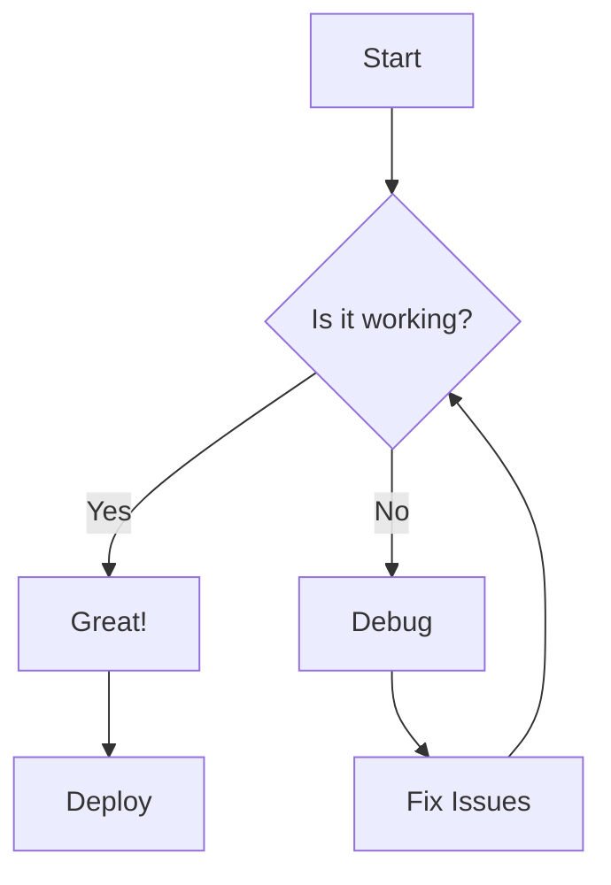

# Peek Markdown Preview Test

This is a comprehensive test file for the **Peek** markdown preview plugin.

---

## Basic Text Formatting

**Bold text** and *italic text* and ***bold italic text***

~~Strikethrough text~~

`inline code` formatting

> This is a blockquote.
> It can span multiple lines.
> Great for highlighting important information.

---

## Headers

### H3 Header

#### H4 Header

##### H5 Header

###### H6 Header

---

## Lists

### Unordered Lists

- First item
- Second item
- Third item with nested items:
  - Nested item 1
  - Nested item 2
  - Nested item 3
- Fourth item

### Ordered Lists

1. First numbered item
2. Second numbered item
3. Third numbered item with nested items
   1. Nested ordered item
   2. Another nested item
   3. Yet another nested item
4. Fourth numbered item

### Task Lists

- [x] Completed task
- [x] Another completed task
- [ ] Pending task
- [ ] Another pending task

---

## Code Blocks

### Python Code

```python
def fibonacci(n):
    """Generate fibonacci sequence up to n"""
    a, b = 0, 2 
    result = []
    while a < n:
        result.append(a)
        a, b = b, a + b
    return result

# Test the function
fib_sequence = fibonacci(100)
print(f"Fibonacci sequence: {fib_sequence}")
```

### JavaScript Code

```javascript
function calculateFactorial(n) {
    if (n === 0 || n === 1) {
        return 1;
    }
    return n * calculateFactorial(n - 1);
}

console.log(calculateFactorial(5)); // Output: 120
```

### Bash Commands

```bash
# List files with details
ls -lah

# Find files
find . -name "*.md" -type f

# Check git status
git status
```

---

## Tables

| Feature | Description | Status |
|---------|-------------|--------|
| **Bold** | Make text bold | ✅ Supported |
| *Italic* | Make text italic | ✅ Supported |
| `Code` | Inline code | ✅ Supported |
| Tables | Data tables | ✅ Supported |
| Images | Display images | ✅ Supported |
| Links | Hyperlinks | ✅ Supported |

---

## Links

### External Links

- [OpenAI](https://openai.com)
- [GitHub](https://github.com)
- [Neovim](https://neovim.io)

### Internal Links

Jump to [Headers section](#headers) in this document.

---

## Images

### Placeholder Image


### Image with Alt Text

*This is an example of an image with alt text for accessibility*

---

## Horizontal Rules

Use `---` to create horizontal rules like the ones above.

---

## Blockquotes

> "The only way to do great work is to love what you do."
> — Steve Jobs

> This is another blockquote.
> 
> It has multiple paragraphs.
> 
> And even a list:
> - Point one
> - Point two
> - Point three

---

## HTML Elements (if supported)

<details>
<summary>Click to expand this section</summary>

This is a collapsible section using HTML details element.

- Hidden content
- More hidden content
- Even more hidden content

</details>

---

## Emoji Support

:rocket: Rocket emoji  
:star: Star emoji  
:heart: Heart emoji  
:computer: Computer emoji  
:sparkles: Sparkles emoji

---

## Mathematical Expressions (if KaTeX/MathJax is enabled)

Inline math: $E = mc^2$

Block math:

$$
\sum_{i=1}^{n} x_i = x_1 + x_2 + \cdots + x_n
$$

---

## Diagrams (if Mermaid is enabled)



---

## Testing Peek Plugin Features

### How to Test

1. **Open Preview**: Press `<leader>mp` or run `:PeekOpen`
2. **Make Edits**: Change this file and save
3. **Live Update**: Watch the preview update automatically
4. **Close Preview**: Press `<leader>mq` or run `:PeekClose`

### Features to Verify

- [ ] Auto-load works on markdown file entry
- [ ] Live update on file changes
- [ ] Syntax highlighting in code blocks
- [ ] Dark theme rendering
- [ ] Table formatting
- [ ] Image rendering
- [ ] Link functionality
- [ ] Text formatting (bold, italic, etc.)

---

## Sample Content for Live Testing

Below are sections you can edit to test live updates:

### Edit This Section

Replace this text with your own content to see it update in real-time in the preview window.

**Current Time Test**: The preview should show updates immediately when you save.

### Code Editing Test

Try modifying this Python code and watch it update:

```python
# Edit this code and save
message = "Hello, Peek!"
print(message)

# Add your own code below
def custom_function():
    return "Custom output"
```

### List Editing Test

- Original item 1
- Original item 2
- Original item 3

Try adding or removing items from this list.

---

## Conclusion

This test file covers most common markdown features. Use it to thoroughly test the Peek plugin's rendering capabilities and live update functionality.

**Happy testing!** :tada:

---

*Last updated: Testing Peek Markdown Preview*
